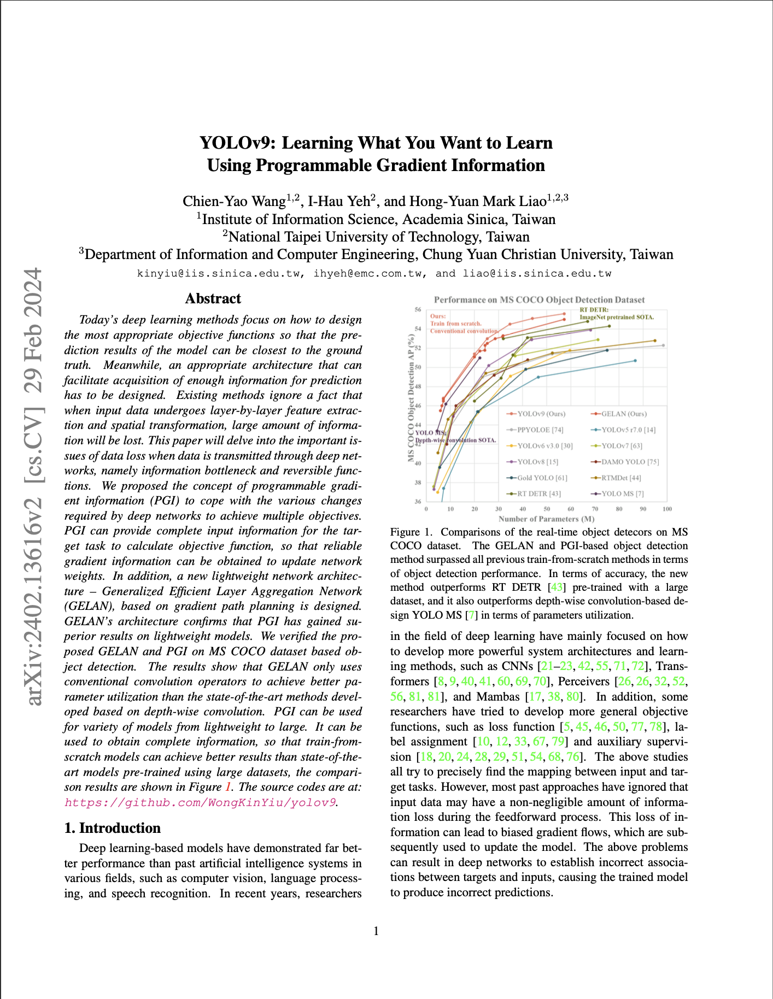
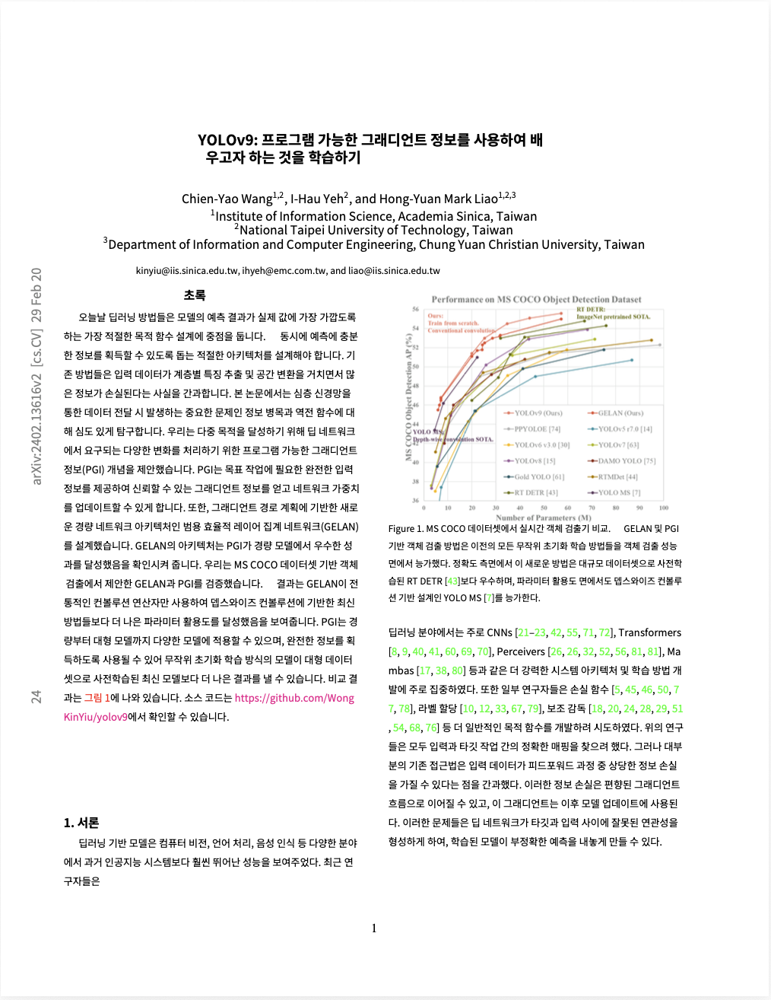

# PDF 번역기

> 🇺🇸 [English version](./README.md)

fixed-layout 기반 PDF에서 좌표 분산된 텍스트 토막을 파싱·재구성하고, 원본 문서의 시각적·구조적 요소를 완전히 보존한 채 번역 PDF를 생성하는 AI 번역 도구입니다.

---

## 데모

<video src="https://github.com/user-attachments/assets/2a3f8c0a-e26c-4280-b90c-1ef846e55b3c" controls width="100%"></video>

### 번역 전 / 후

*YOLOv9 논문 (arXiv:2402.13616) — 첫 페이지*

| 원본 (영어) | 번역본 (한국어) |
|---|---|
|  |  |

---

## 배경

PDF는 **fixed-layout 형식**입니다. 텍스트는 단락 구조 없이 좌표 위치 정보와 함께 분산된 토막으로 저장됩니다. 눈에 보이는 한 문장도 파일 내부에서는 수십 개의 분리된 span으로 쪼개져 있고, 각각은 위치 메타데이터만 보유합니다.

이 때문에 PDF 번역은 일반 텍스트 번역과 근본적으로 다릅니다. PDF에서 추출한 텍스트를 그대로 번역 API에 넣으면 순서가 뒤섞이고 의미가 깨진 결과가 나옵니다. 핵심 문제는 번역을 시작하기 전에 **좌표 기반의 텍스트 토막을 사람의 읽기 흐름에 맞게 재구성하는 것**입니다.

---

## 파이프라인

```
PDF 입력
    │
    ▼
[1단계] 문서 분석
    - PyMuPDF로 페이지별 좌표 기반 텍스트 span 추출
    - 좌표 관계를 분석해 문단·읽기 흐름 복원
    - GPT로 전문 용어집 사전 추출 (번역 일관성 확보)
    │
    ▼
[2단계] 전처리
    - YOLO로 각 블록의 유형 분류 (그림 / 표 / 목록 / 수식 등),
      유형에 맞는 처리 알고리즘으로 라우팅
    - 분산된 span을 의미 단위 텍스트 블록으로 병합
    - 읽기 순서 추론 및 정렬 (다단, 각주, 캡션 처리)
    - 인라인 요소 탐지·태깅: 윗첨자, 아랫첨자, 스타일 전환
    - PDF 파싱 아티팩트 정제 (하이픈네이션, 인코딩 노이즈 등)
    │
    ▼
[3단계] 번역
    - 용어집 + 페이지 컨텍스트를 포함하여 GPT로 블록별 번역
    - 인라인 스타일 마커(볼드, 이탤릭, 폰트 크기 변화) 보존
    - 번역 전후 윗첨자·아랫첨자 위치 유지
    │
    ▼
[4단계] PDF 재구성
    - 각 블록 영역의 원본 텍스트 제거
    - 번역 텍스트를 원본 좌표에 재렌더링
    - 폰트 패밀리, 크기, 색상, 굵기, 기울임 복원
    - 하이퍼링크 및 기능 요소를 번역된 텍스트 위치에 재부착
    - {파일명}-ko.pdf로 저장
```

---

## 보존되는 요소

| 요소 | 보존 여부 |
|---|---|
| 문단 구조 및 읽기 순서 | ✅ |
| 폰트 크기·색상·굵기(볼드)·기울임(이탤릭) | ✅ |
| 윗첨자·아랫첨자 | ✅ |
| 하이퍼링크 및 기능 요소 | ✅ |
| 다단 레이아웃 | ✅ |
| 전문 용어 일관성 (용어집 활용) | ✅ |

---

## 기술적 도전

### 1. 좌표 토막에서 읽기 순서 복원
Fixed-layout PDF는 텍스트를 좌표 span으로만 저장합니다. 파일 형식 자체에 "문단"이나 "문장" 개념이 없습니다. 파이프라인은 인접성, 정렬, 칼럼 경계, 폰트 크기 변화 등 공간적 관계를 분석해 읽기 흐름을 추론합니다. 다단 레이아웃, 각주, 그림 캡션이 섞인 경우에도 읽기 순서가 깨지지 않도록 처리합니다.

### 2. 번역 전후 인라인 스타일 보존
텍스트 블록 내에 혼합 스타일(문단 중간의 볼드 키워드, 윗첨자 인용 번호 등)이 포함되는 경우가 많습니다. 번역 전 글자 단위로 스타일 메타데이터를 추출하고, 번역 후 텍스트 길이가 달라지더라도 스타일을 재적용합니다.

### 3. 문서 전체 용어 번역 일관성
기술 문서의 전문 용어는 컨텍스트에 따라 여러 방식으로 번역될 수 있습니다. 번역 전 용어집 추출 단계(GPT 활용)에서 핵심 용어의 번역어를 확정하고, 이후 페이지별 번역 전 과정에 적용하여 문서 전체의 일관성을 유지합니다.

### 4. 영문 전용 PDF에서의 한국어 폰트 렌더링
대부분의 영문 PDF에는 라틴 폰트만 내장되어 있습니다. 원본과 가장 유사한 시스템 폰트 패밀리를 탐지하고, CJK 렌더링이 가능한 호환 폰트로 대체하여 시각적 일관성을 유지합니다.

### 5. 번역 후 줄 간격 재계산
영어와 한국어는 글자 밀도가 달라, 번역 결과가 원본과 다른 줄 수를 만들어내는 경우가 많습니다. 원본 좌표에 그대로 렌더링하면 줄이 블록을 벗어나거나 빈 공간이 생깁니다. 번역된 라인 수와 원본 블록의 바운딩 박스를 기반으로 줄 간격을 동적으로 재계산하여, 번역 결과가 지정된 영역 안에 맞게 배치되도록 합니다.

---

## 기술 스택

| 분류 | 기술 |
|---|---|
| PDF 처리 | PyMuPDF (fitz) |
| 레이아웃 탐지 | YOLO (Ultralytics) |
| 번역 | OpenAI GPT API |
| 동시성 처리 | Python ThreadPoolExecutor |
| 언어 | Python 3.10+ |

---

## 프로젝트 상태

이 레포지토리는 문서와 데모만 포함합니다. 소스 코드는 이전 직장에서 개발된 사내 코드로 공개되지 않습니다.

---

## 라이선스

MIT
